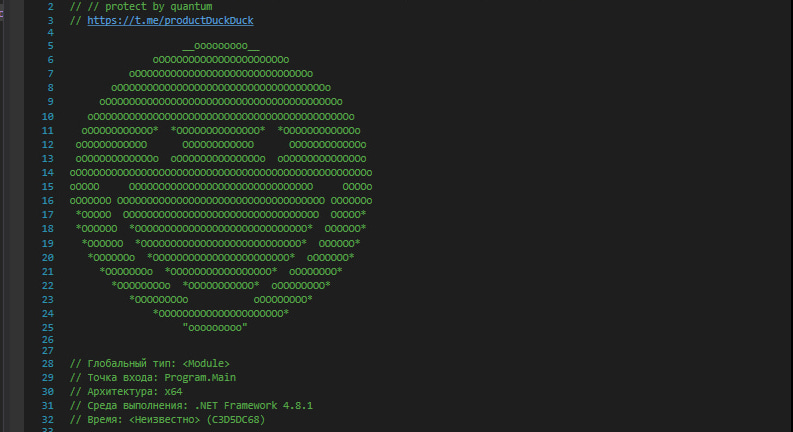

# AsciiInjector

A simple C# tool that injects a large ASCII art watermark into the metadata of .NET assemblies (DLL/EXE). It's a fun way to "sign" your application using the **Mono.Cecil** library.

